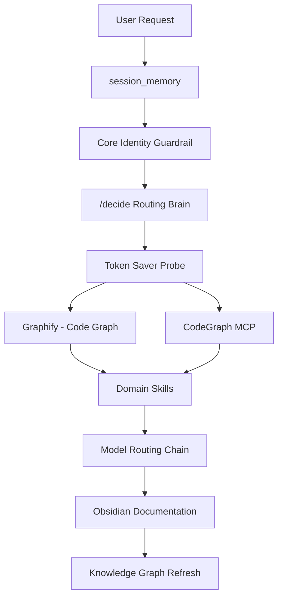

# Hermes Workflow

**AI Agent Workflow Engine** — 641 skills, 64 ECC agents, 18 LLMQuant domains, 5-layer free model routing (★ DeepSeek V4 Flash via OpenCode recommended), permanent guardrail, 56× token saver, live ecosystem dashboard, and mandatory Obsidian knowledge graph documentation.

## 🚀 Plug-and-Play Setup

Get the full pipeline running in 5 minutes.

### 1. Prerequisites

```bash
# Hermes Agent (required)
curl -fsSL https://hermes-agent.nousresearch.com/install.sh | sh   # macOS/Linux
# or: irm https://hermes-agent.nousresearch.com/install.ps1 | iex   # Windows PowerShell
# or: pip install hermes-agent

# Python 3.10+, Node.js v18+, Git 2.30+
python3 --version && node --version && git --version

# uv — fast Python package manager
# https://docs.astral.sh/uv/
uv --version || curl -fsSL https://astral.sh/uv/install.sh | sh
```

### 2. Clone & Configure

```bash
git clone https://github.com/AttilaHuns288452/hermes-workflow.git
cd hermes-workflow

# Copy and customize the config template → your Hermes profile
cp config.yaml.template ~/.hermes/config.yaml
# Edit ~/.hermes/config.yaml — replace YOUR_USERNAME and paths

# Copy and customize environment variables
cp .env.example .env
# Edit .env — fill in your API keys and paths
source .env
```

### 3. Install Tools (5-Minute Stack)

| Tool | Layer | Install Command | Notes |
|------|-------|----------------|-------|
| **OpenCode** | Free Model Layer 1 | `npm install -g opencode` or [download](https://github.com/opencode-ai/opencode/releases) | Primary coding agent |
| **Graphify** | Code Knowledge Graph | `uv tool install graphifyy` | AST code graph |
| **CodeGraph** | Live MCP Code Index | `npm install -g @colbymchenry/codegraph` | Live MCP code probe |
| **FreeLLMAPI** | Free Model Layer 3 | `git clone https://github.com/tashfeenahmed/freellmapi.git && cd freellmapi && npm install` | 107 models proxy |
| **Ponytail** | AI Lazy Mode Plugin | `npm install -g @dietrichgebert/ponytail` | YAGNI enforcer, -54% code |

```bash
# Verify installations
hermes --version && codegraph --version && graphify --version
```

### 4. Load Skills & Run

```bash
# Install bundled skills into your Hermes profile
hermes skills install ./skills/workflow
hermes skills install ./skills/decide

# Test the pipeline end-to-end
hermes run "What does the decide skill do?"

# Full pipeline test (requires Obsidian vault configured)
hermes run "Summarize this repo structure"
```

> **Detailed instructions:** See [`SETUP.md`](SETUP.md) for the full 10-step walkthrough.  
> **Config reference:** [`config.yaml.template`](config.yaml.template) documents every MCP server and setting.  
> **Environment reference:** [`.env.example`](.env.example) lists all configurable variables.

## 🌙 Overview

This repository documents the **Hermes Agent** ecosystem — a multi-model AI agent framework from **Nous Research** that runs skills (reusable workflows) to execute coding, creative, research, finance, media, and productivity tasks.

The system centers on the **`/decide`** skill, a master orchestrator that:
1. Retrieves prior session context via `session_memory`
2. Runs the **Core Identity Guardrail** (permanent, never skipped)
3. Applies a 5-step reasoning protocol to decompose and route requests
4. Probes **CodeGraph MCP** + **Graphify** before any file read (56.2× token savings)
5. Selects and sequences the right skills for every domain
6. Routes models through a 5-layer free chain (OpenCode → Freebuff → FreeLLMAPI → OpenRouter → Paid)
7. Finishes with **mandatory Obsidian documentation** + **galaxy knowledge graph refresh**

## 🖥️ Website

The static GitHub Pages site at **[https://attilahuns288452.github.io/hermes-workflow/](https://attilahuns288452.github.io/hermes-workflow/)** showcases:

- **508 Skills** — categorized tab grid with colored category badges (165 core + 343 external)
- **Getting Started section** — install Hermes, clone skills, recommended model setup
- **★ DeepSeek V4 Flash recommendation** — using OpenCode Zen API as primary free model
- **64 ECC Agents** — searchable, filterable library with free-model compatibility badges
- **Live Dashboard** — ecosystem overview: 16 projects, 508 skills, 26K APIs, graph nodes, model layers, MCP servers
- **Model Routing Chain** — 5-layer fallback chain (OpenCode → Freebuff → FreeLLMAPI → OpenRouter → Paid)
- **Token Saver** — 56.2× verified token reduction via CodeGraph + Graphify probe
- **Core Identity Guardrail** — 6 permanent safety rules
- **Knowledge Graph** — 276 nodes / 1,091 edges galaxy visualization
- **18 LLMQuant Domains** — quant finance skill suite
- **Use Cases** — real projects executed end-to-end
- **Obsidian Documentation Standard** — ATM-Machine quality template

## 🔧 Key Stats

| Metric | Value |
|--------|-------|
| Skills | 508 across all categories (165 core + 343 external) |
| ECC Agents | 64 (57 free-compatible via ecc-bridge) |
| Projects | 16 (3 with Graphify graphs) |
| API Mega List | 26,005 APIs across 18 categories |
| CodeGraph MCP | 945 files / 16,092 nodes / 43,795 edges (codegraph repo — reference scale) |
| Graphify | 8,267 nodes / 13,225 edges / 775 communities (graphify repo — reference scale) |
| Token Savings | 56.2× average (up to 157.7× per query) |
| Knowledge Graph | 276 nodes / 1,091 edges |
| Free Models | 156 across 5 routing layers |
| MCP Servers | 6 wired (CodeGraph, Graphify, VS Code, LLMQuant, Obsidian KG, agentmemory) |
| LLMQuant Domains | 18 quant-finance workflows |
| Obsidian Project Notes | 8 (ATM-Machine quality standard) |

## 🏗️ Architecture



## 🌐 Ecosystem

- **Hermes Agent** — Multi-model agent framework (Nous Research)
- **ECC Agents** — 64 specialized agents bridged via free model chain
- **CodeGraph MCP** — Live code knowledge (v0.9.9)
- **Graphify** — AST code graph (v0.8.37)
- **LLMQuant** — 18 quant-finance domain skills
- **free-ai-tools** — 550+ free AI tools, 238 models
- **OpenCode CLI** — Primary coding agent with 5 free models
- **Freebuff** — Cloud free model extensions (Kimi K2.6, MiniMax M3, etc.)
- **FreeLLMAPI** — 107 models, 84 available (13 provider keys)
- **API Mega List** — 10,498 ready-to-use Apify APIs across 18 categories (searchable via `productivity/api-mega-list` skill)
- **Ponytail** — YAGNI lazy-mode AI plugin (DietrichGebert, 6 pony skills: ponytail, ponytail-review, ponytail-audit, ponytail-debt, ponytail-gain, ponytail-help)
- **MoneyPrinterTurbo** — AI short video generation (86.1k ⭐)

## 📄 License

This project's documentation and website content are licensed under [CC BY-NC 4.0](LICENSE).

## 💾 Backup & Restore

Hermes is backed up daily to Google Drive at **2:00 AM** (via Hermes cron). The backup captures **everything** needed for a complete plug-and-play migration to a new device.

### What's backed up

| Item | Why |
|------|-----|
| `config.yaml` | All Hermes settings, MCP servers, providers |
| `.env` | API keys (shared across all profiles) |
| `auth.json` | OAuth tokens |
| `profiles/*/` | Every profile's config, state, sessions, memories, skills |
| `skills/` | Custom skills |
| `memories/` | Persistent cross-session memory |
| `state.db` | Full session database |
| `scripts/` | Backup, restore, and sync scripts |
| `plugins/` | Plugin configurations |
| `external/` | Rclone config, external skill repos |

### Backup & Restore Scripts

```
scripts/
├── run-hermes-backup.py       # Daily backup to Google Drive (runs via cron)
├── restore-hermes-backup.py   # Plug-and-play restore on new device
└── sync-hermes-credentials.py # Sync .env + auth.json to all profiles
```

### How to Restore

```bash
# On your new machine, install Hermes and set up rclone with $RCLONE_REMOTE
# Then run:
python /path/to/restore-hermes-backup.py --restore-latest

# Or download and restore a local ZIP:
python restore-hermes-backup.py --local-backup Hermes_Backup_2026-06-30.zip
```

### Syncing Credentials Across Profiles

After adding new API keys, run the sync script to propagate them to all profiles:

```bash
python /path/to/sync-hermes-credentials.py
```

All profiles share MCP servers from the root config — no duplication needed.

---

*Theme: Dark Navy Moonlight · Updated: Jul 2026 · ★ DeepSeek V4 Flash recommended*
