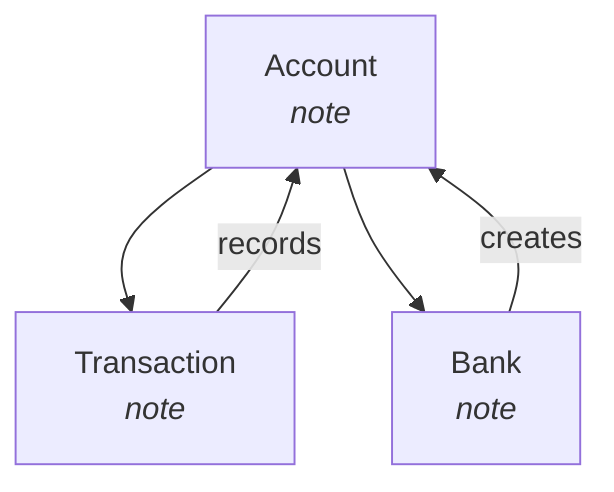

# MCP Server Development for Hermes

Hermes has a built-in MCP **client** that connects to MCP servers at startup. This reference covers how to **develop** MCP servers that Hermes (or any MCP client) can use — the server side of the equation.

## When to Build a Custom MCP Server

- A CLI or API exists but no community MCP server wraps it
- You need domain-specific tools (vault scanning, code analysis, project graph, etc.)
- You want to expose local resources (filesystem, databases, running processes) as MCP tools
- You need server-initiated LLM sampling (`sampling/createMessage`)

## Quick Start: Python stdio Server

```bash
pip install mcp
```

```python
# my_mcp_server.py
from mcp.server import Server
from mcp.server.stdio import stdio_server
from mcp.types import Tool, TextContent, ListToolsResult, CallToolResult
import json

app = Server("my-server")

@app.list_tools()
async def list_tools() -> ListToolsResult:
    return ListToolsResult(tools=[
        Tool(
            name="my_tool",
            description="Does something useful",
            inputSchema={
                "type": "object",
                "properties": {"param": {"type": "string"}},
                "required": ["param"],
            },
        )
    ])

@app.call_tool()
async def call_tool(name: str, arguments: dict) -> CallToolResult:
    if name == "my_tool":
        param = arguments["param"]
        result = do_something(param)  # your logic here
        return CallToolResult(content=[TextContent(type="text", text=json.dumps(result))])
    return CallToolResult(content=[TextContent(type="text", text=f"Unknown tool: {name}")], isError=True)

async def main():
    async with stdio_server() as (r, w):
        await app.run(r, w, app.create_initialization_options({
            "serverInfo": {"name": "my-server", "version": "1.0.0"},
        }))

if __name__ == "__main__":
    import asyncio
    asyncio.run(main())
```

## Registering with Hermes

Add to `~/.hermes/config.yaml`:

```yaml
mcp_servers:
  my_server:
    command: "python"
    args: ["-m", "my_mcp_server"]
    cwd: "/absolute/path/to/server"
    connect_timeout: 30
```

Restart Hermes. Tools appear as `mcp_my_server_my_tool`.

## Key Patterns from This Session

### 1. Vault Scanner MCP Server

**File:** `~/.hermes/tools/obsidian_kg_mcp.py`

**Capabilities demonstrated:**
- Walks a directory tree (Obsidian vault)
- Extracts structured nodes: vault, folders, notes, code blocks, tags, concepts, aliases
- Extracts edges: contains, links_to (wikilinks), tagged, shared_concept, alias_of
- Exposes two tools:
  - `obsidian_knowledge_graph(vault_path, include_code_blocks, include_concepts, concept_min_occurrences)`
  - `obsidian_graph_summary(vault_path)`
- Returns JSON with `{nodes: [...], edges: [...], stats: {...}}`

**Pattern for folder→note→code_block hierarchy:**
```python
# First pass: register all folders and notes, track path→node mapping
folder_node_map: dict[Path, Node] = {}
note_node_map: dict[str, Node] = {}

# Second pass: parse content for tags, wikilinks, code blocks, concepts
```

### 2. Rendering the Graph as Interactive HTML

Used `pyvis` with hierarchical layout options:

```python
net.set_options("""
{
  "layout": {
    "hierarchical": {
      "enabled": true,
      "direction": "UD",           # top-down
      "levelSeparation": 180,
      "nodeSpacing": 220,
      "treeSpacing": 280,
      "blockShifting": true,
      "parentCentralization": true
    }
  },
  "physics": {
    "hierarchicalRepulsion": {
      "centralGravity": 0.0,
      "springLength": 200,
      "springConstant": 0.02,
      "nodeDistance": 180,
      "damping": 0.9
    },
    "solver": "hierarchicalRepulsion",
    "stabilization": {"enabled": true, "iterations": 300}
  }
}
""")
```

### 3. Mermaid Flowcharts in Obsidian Notes

Each note gets a local flowchart showing its immediate graph neighborhood:

```markdown
## Knowledge Graph Position


```

Renders natively in Obsidian — no plugin needed.

## Common Pitfalls

| Issue | Fix |
|-------|-----|
| `ModuleNotFoundError: mcp` | `pip install mcp` (or `uv pip install mcp`) |
| Tools don't appear after config change | Restart Hermes — MCP discovery runs at startup only |
| Server hangs on startup | Check `connect_timeout` — increase if server takes >60s to initialize |
| `TypeError: 'Node' object is not subscriptable` | Use `.id` not `["id"]` — dataclass vs dict |
| Windows path issues in config.yaml | Use double backslashes `C:\\\\Users\\\\...` or forward slashes `C:/Users/...` |
| pyvis not found in Hermes venv | Install in system Python and run render script with that interpreter |

## Testing MCP Servers Manually

```bash
# Initialize + list tools
printf '{"jsonrpc":"2.0","id":1,"method":"initialize","params":{"protocolVersion":"2024-11-05","capabilities":{},"clientInfo":{"name":"test","version":"1"}}}\n{"jsonrpc":"2.0","method":"notifications/initialized"}\n{"jsonrpc":"2.0","id":2,"method":"tools/list"}\n' | python -m my_mcp_server
```

## Security Notes

- Hermes filters env vars passed to stdio servers (only PATH, HOME, USER, LANG, TERM, SHELL, TMPDIR, XDG_*)
- Explicitly declare secrets in config.yaml `env:` if the server needs them
- Credential-like patterns in error messages are auto-redacted

## References

- [MCP Specification](https://modelcontextprotocol.io/specification)
- [Python MCP SDK](https://github.com/modelcontextprotocol/python-sdk)
- Hermes native client: `skill_view("hermes-agent", "references/native-mcp.md")`