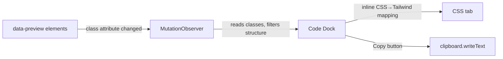

# Interactive Demo Pages

Build self-contained interactive HTML pages that demonstrate CSS utilities through hands-on class toggling with live previews and real-time code output.

## When to Use

- Creating an interactive reference page for a CSS framework (Tailwind, Bootstrap, etc.)
- Building a playground where users can toggle classes and see results instantly
- Designing tutorial/learning pages with live demos
- Any page with 5+ interactive demo sections that need code output

## Architecture Pattern

### Component Tree (Single HTML File)

```
Page
├── Sidebar (category navigation + search)
├── Content Area
│   ├── Welcome Section
│   ├── Section A (display: none by default)
│   ├── Section B
│   └── ...N sections
└── Floating Code Dock (sticky bottom)
    ├── Tailwind/CSS tab toggle
    ├── Code display (auto-updating)
    └── Copy button
```

### Key Building Blocks

Each section follows the same pattern:

```html
<div class="section-card" data-demo-id="section-name">
  <h3>Title</h3>
  <div class="flex gap-2 mb-4">
    <button class="btn-option active"
      onclick="demoHandler(this,'class-name')">Class</button>
    <!-- more buttons -->
  </div>
  <div data-preview class="preview-box structural classes">
    <!-- content that gets class changes applied -->
  </div>
</div>
```

### Handler Pattern

Every handler receives `(btn, className)` where `btn` is `this` from the onclick:

```js
window.demoHandler = function(btn, cls) {
  // 1. Deactivate siblings, activate clicked button
  const container = btn.closest('[data-demo-id]');
  container.querySelectorAll('.btn-option').forEach(b => b.classList.remove('active'));
  btn.classList.add('active');

  // 2. Update preview — filter old class first
  const preview = container.querySelector('[data-preview]');
  preview.className = preview.className.replace(/previous-class-regex/g, '').trim();
  preview.classList.add(cls);
};
```

## Core Technique: Floating Code Dock

Replace N per-section code viewers with ONE code dock driven by a MutationObserver. See `references/floating-code-dock-pattern.md` for full implementation.

### How It Works



### Benefits

- **Zero boilerplate per section** — just add `data-preview` and `data-demo-id`
- **Auto-updates** — any class change is captured, even from sliders or checkboxes
- **CSS mapping is shared** — one `twToCss()` function serves all sections
- **Copy button works globally** — reads from dock's current text

#For 10+ components with 2-5 style variants each, use the data-driven approach in `references/data-driven-components.md` instead of per-section handlers.

## When NOT to Use

- Single interactive element (add a dedicated `<pre>` next to it)
- Syntax-highlighted code needed (use a library per section)
- Few sections (< 3) with sparse interactions (handler-side refresh is simpler)

## Utilities

### `escHtml` (required for code display safety)

```js
function escHtml(s) {
  return String(s).replace(/&/g,'&amp;').replace(/</g,'&lt;').replace(/>/g,'&gt;').replace(/\"/g,'&quot;');
}
```

Wrap any HTML string before placing it into a code display's textContent via template literal interpolation (runtime `textContent` assignments auto-escape via the DOM).

### HTML formatting for code displays

When the code display shows HTML template source, format it with indentation. Use a simple formatter that splits on `><` and tracks nesting depth:

```js
function prettyHTML(s) {
  let d=0, r='';
  const V=new Set(['area','base','br','col','embed','hr','img','input','link','meta','param','source','track','wbr']);
  const lines=s.replace(/>/g,'>\n').replace(/</g,'\n<').split('\n').map(l=>l.trim()).filter(Boolean);
  for (let l of lines) {
    const cl=l.startsWith('</'), se=l.endsWith('/>'), co=l.startsWith('<!--');
    const tag=l.match(/^<(\w+)/)?.[1];
    if (cl) { r+='  '.repeat(d)+l+'\n'; d=Math.max(0,d-1); }
    else if (se||co||(tag&&V.has(tag))) { r+='  '.repeat(d)+l+'\n'; }
    else if (l.startsWith('<')) { r+='  '.repeat(d)+l+'\n'; d++; }
    else { r+='  '.repeat(d)+l+'\n'; }
  }
  return r.trim();
}
```

Usage: initial render → `escHtml(prettyHTML(v.h || '...'))`. Runtime `textContent` → `code.textContent = prettyHTML(v.h || '...')`.

## Section Card Template

```js
function sectionCard(title, subtitle, contentHTML) {
  const div = document.createElement('div');
  div.className = 'bg-slate-800/50 rounded-xl border border-slate-700/50 p-4 md:p-6 mb-6 fade-in';
  div.innerHTML = `
    ${title ? `<div class="mb-4"><h3 class="text-lg font-semibold text-slate-100">${title}</h3>${subtitle ? `<p class="text-sm text-slate-400 mt-0.5">${subtitle}</p>` : ''}</div>` : ''}
    ${contentHTML}
    ${subtitle ? `<pre data-code class="text-xs text-slate-400 mt-1 font-mono overflow-x-auto whitespace-pre-wrap max-h-12">${escHtml(subtitle)}</pre>` : ''}
  `;
  return div;
}
```

The `<pre data-code>` element is auto-inserted. Its content should be dynamically replaced with the live class list by a MutationObserver when the section has interactive controls (see Pitfalls below for DOM traversal).

To wrap a sectionCard call as an HTML string for concatenation:
```js
const sc = (...a) => sectionCard(...a).outerHTML;
```

## Extending an Existing Playground with a New Section

Four steps every time:

1. **Sidebar entry** — add to `categories[]`: `{ id: 'myFeature', name: 'My Feature', icon: '★' }`
2. **Search data** — add to `searchData[]`: `{ id: 'myFeature', terms: ['keyword1', 'keyword2'] }`
3. **Builder function** — `function buildMyFeature()` returning `<div class="category-section" id="section-myFeature">`. Use `sectionCard()`, `livePreview()`, `codeViewer()` helpers. Use `escHtml()` for code display safety.
4. **Build order** — add `buildMyFeature()` to `buildAllSections()`

The builder is a regular function in the inline `<script>`; all helpers (`escHtml`, `sectionCard`, `codeViewer`, `switchCodeTab`, `copyCode`) are available and shared across all sections.

### Promo/CTA Cards Linking to Other Sections

In the Components section, add gradient info cards that navigate to utility sections via `navigateTo()`:

```js
html += `<div onclick="navigateTo('shadow')"
  class="section-card bg-gradient-to-br from-slate-800/50 to-blue-900/20
         rounded-xl border border-slate-700/50 p-4 md:p-6 fade-in
         cursor-pointer hover:border-blue-500/50 hover:shadow-lg
         hover:shadow-blue-500/10 transition-all">
  <div class="flex items-start gap-3">
    <span class="text-2xl">◑</span>
    <div>
      <h3 class="text-base font-semibold mb-1">Want to add shadows to your button?</h3>
      <p class="text-sm text-slate-400">
        Description text here —
        <span class="text-blue-400 font-medium">click here for more →</span>
      </p>
    </div>
  </div>
</div>`;
```

Each card uses `to-{color}-900/20` gradient and `hover:border-{color}-500/50` glow. Arrange in `<div class="grid grid-cols-1 md:grid-cols-2 gap-4 mb-6">` for responsive pairs.

### Animation Sections with Live CSS Previews

For a section demonstrating CSS animations, put animated elements directly in the innerHTML string. Add restart and speed controls:

```js
// Speed buttons change animation-duration
<div class="flex gap-2">
  <button class="btn-option active" onclick="animSpeed('spin','1s')">1s</button>
  <button class="btn-option" onclick="animSpeed('spin','500ms')">.5s</button>
</div>

// Restart: remove animation, force reflow, re-add
<button onclick="event.target.closest('.section-card')
  .querySelectorAll('[class*=animate]').forEach(e => {
    e.style.animation='none';
    void e.offsetHeight;
    e.style.animation='';
  })" class="btn-option text-xs">Restart</button>

// Speed handler
window.animSpeed = function(name, dur) {
  document.getElementById('section-animation')
    .querySelectorAll(`.animate-${name}`)
    .forEach(e => e.style.animationDuration = dur);
};
```

For `animate-ping/pulse` restart across the whole section (not just one card), scope to `#section-animation [class*=animate]` and toggle animation via `'none'` → reflow → `''`.

## Special Cases

### Dual-axis components (Button: variant + size)

When a component has TWO independent toggle axes (e.g., solid/outline/ghost × sm/md/lg), the data-driven `compUpdate` won't work because the state is a combination. Handle these separately outside the `compDefs` loop:

```js
// Button has btnVar (solid/outline/ghost) AND btnSize (sm/md/lg)
window.compUpdate = function(prop, value) {
  if (prop === 'btnVar' || prop === 'btnSize') {
    compState[prop] = value;
    const btn = document.getElementById('compBtnPreview');
    const vars = {
      solid:  'bg-blue-600 hover:bg-blue-500 text-white font-medium rounded-lg',
      outline:'border-2 border-blue-500 text-blue-400 hover:bg-blue-500/10 font-medium rounded-lg',
      ghost:  'text-slate-300 hover:bg-slate-700/50 font-medium rounded-lg'
    };
    const siz = { sm: 'px-3 py-1.5 text-xs', md: 'px-4 py-2 text-sm', lg: 'px-6 py-3 text-base' };
    btn.className = (vars[compState.btnVar]||vars.solid) + ' ' + (siz[compState.btnSize]||siz.md);
    // Show full HTML, not just classes
    document.getElementById('compBtnCode').textContent =
      prettyHTML('<button class="' + btn.className + '">Button</button>');
    return;
  }
  // ... normal data-driven update
};
```

**Key:** Combine both axis values into a single class string. Use `compState` to persist the selected values across calls.

### State-machine components (Input: default/focus/error/disabled)

When a component has MUTUALLY EXCLUSIVE states that affect multiple DOM properties (classes, text, disabled attrs), use a state lookup table:

```js
if (prop === 'input') {
  const el = document.getElementById('compInput');
  const hint = document.getElementById('compInputHint');
  const st = {
    default: 'border-slate-600 focus:border-blue-500 text-slate-200',
    focus:   'border-blue-400 ring-2 ring-blue-400/30 text-slate-200',
    error:   'border-red-500 ring-1 ring-red-500/30 text-red-300 placeholder-red-400',
    disabled:'border-slate-700 text-slate-500 bg-slate-800/50 cursor-not-allowed'
  };
  el.className = 'w-full bg-slate-800 text-sm rounded-lg px-3 py-2 outline-none transition-all '
    + (st[value]||st.default);
  el.disabled = value === 'disabled';
  hint.textContent = {default:'Enter your email', focus:'Type your email',
    error:'Please enter a valid email', disabled:'This field is currently disabled'}[value]||'';
  hint.className = 'text-xs mt-1 ' + (value==='error' ? 'text-red-400' : 'text-slate-500');
  // Show full HTML in code display
  document.getElementById('compInputCode').textContent =
    prettyHTML('<input class="' + el.className + '" type="email" value="hello@example.com" placeholder="Enter your email"'
      + (el.disabled ? ' disabled' : '') + ' />');
  return;
}
```

**Key:** Use objects as lookup tables. Return early before the data-driven `compUpdate` logic to avoid conflicting state management.

### Initial render fallback matches runtime fallback

The initial render template literal MUST produce the same output as `compUpdate` for the default variant, otherwise the code display appears to change on first click. Use the same fallback chain:

```js
// Initial render (inside compDefs .map() callback, t = current compDef)
`<pre ... id="comp${pid}Code">${escHtml(prettyHTML(
  v.h || '<div class="' + (v.c||'') + '">' + (t.html||v.d||'') + '</div>'
))}</pre>`

// Runtime update (def = compDefs.find(...))
code.textContent = prettyHTML(
  v.h || '<div class="' + (v.c||'') + '">' + (def.html||v.d||'') + '</div>'
);
```

Note the `t.html` vs `def.html` distinction — `t` exists only inside `.map()`, `def` is the lookup result (see Pitfalls).

### Data Attributes Convention

| Attribute | Purpose |
|-----------|---------|
| `data-demo-id` | Scopes a demo section (for `closest()` lookups) |
| `data-preview` | Watched by MutationObserver for class changes |
| `data-code-block` | Optional: dedicated code block per section (when not using global dock) |

### Button Class Convention

```css
.btn-option { /* base: unselected state */ }
.btn-option.active { /* selected state — blue bg, white text */ }
.btn-option:not(.active):hover { /* hover: slightly lighter */ }
```

### Handler Conventions

Every handler must:
1. Accept `(btn, ...args)` — `btn` is `this` from onclick
2. Deactivate siblings before activating clicked button
3. Filter out old class(es) before adding new one
4. NOT reference `event.target` (use the `btn` parameter)

## Verification

- [ ] Every section has a unique `data-demo-id`
- [ ] Every section has at least one `[data-preview]` element
- [ ] No `event.target` or `event?.target` references in handlers
- [ ] Floating code dock auto-shows when a demo changes
- [ ] Copy button copies the correct current classes
- [ ] Sidebar navigation switches sections correctly
- [ ] Search filters categories and navigates to first result
- [ ] Progress tracking updates as sections are visited

## Pitfalls

### DOM traversal for per-card code displays

When wiring a MutationObserver to update a `<pre data-code>` inside the same card, do NOT use `nextElementSibling` — the preview's next sibling is usually the buttons div, not the code element. Walk up then query down:

```js
// WRONG — lands on buttons div, code never updates
const code = box.nextElementSibling;

// RIGHT — walks up to card root, then queries for the first [data-code] inside it
// Use parentElement when .preview-box is a direct child of the card
const code = box.parentElement.querySelector('[data-code]');

// STRONGEST — works even if .preview-box is nested inside wrapper divs
const code = box.closest('.section-card').querySelector('[data-code]');
```

The `closest()` variant handles any nesting depth and is the most robust choice. It requires the card root to have a `.section-card` class.

### Variable scoping in data-driven component updaters

When referencing the component's default `html` field inside event handlers called after initial render, use the lookup variable, not the `.map()` iteration variable:

```js
// In the builder (t exists in .map() scope — works)
compDefs.map(t => {
  return escHtml(v.h || t.html || v.d || '');
});

// In the updater (t is NOT defined — ReferenceError)
function compUpdate(prop, value) {
  const def = compDefs.find(d => d.id === prop);
  code.textContent = v.h || t.html || v.d || '';   // ReferenceError
  code.textContent = v.h || def.html || v.d || '';  // CORRECT
}
```

### Code display fallback chain

For "full code" display showing HTML structure (not just CSS classes), use a fallback chain that constructs the wrapper element when `v.h` (HTML template) is absent:

```js
// Shows full code: variant HTML → constructed <div> with classes + default inner → description
code.textContent = v.h || '<div class="'+(v.c||'')+'">'+(def.html||v.d||'')+'</div>';

// NOT this — shows only classes, hides HTML structure
code.textContent = v.h || v.c || def.html || v.d || '';
```

### Index-based selectors over `:nth-child()` for card picking

When a section has variant heading/p elements before `.section-card` children, `:nth-child(n)` fails because it counts ALL siblings, not just matching ones:

```js
// WRONG — section-card is the 5th child, not 3rd (h2=1st, p=2nd, then cards)
const offsetCard = document.querySelector('#section-ring .section-card:nth-child(3)');

// RIGHT — counts only section-cards, immune to heading count
const cards = document.querySelectorAll('#section-ring .section-card');
const offsetCard = cards[2];  // 3rd section-card regardless of siblings before
```

Use `querySelectorAll('.section-card')[n]` whenever cards follow headings in a flex/grid wrapper. Prevents breakage when section titles or intro text are added or removed.

### `\\n` in template literals renders as literal text, not newlines

When a JS template literal (backtick string) inside a `<script>` tag contains `\\n`, it produces the literal text `\n` in the HTML, not a line break:

```js
// WRONG — shows "display: flex;\\nborder-right: 1px solid #475569;" as one line
`<code>display: flex;\\nborder-right: 1px solid #475569;</code>`

// RIGHT — real line break renders in <pre><code>
`<code>display: flex;\nborder-right: 1px solid #475569;</code>`

// BEST — use escHtml() to set textContent (auto-escapes & handles newlines correctly)
codeEl.textContent = 'display: flex;\nborder-right: 1px solid #475569;';
```

`.textContent` assignment auto-escapes HTML and handles `\n` newlines natively. Prefer it over building inline `<code>` content via innerHTML for multi-line code.

### MutationObserver lifecycle without variable reference

A MutationObserver created inline (not stored in a variable) is kept alive by the observed DOM node's strong internal reference — no `disconnect()` needed unless the node is removed and re-added:

```js
// Observer lives until #ringDemo1 leaves the DOM
new MutationObserver(() => { code.textContent = ...; })
  .observe(inner, { attributes: true, attributeFilter: ['class'] });
```
