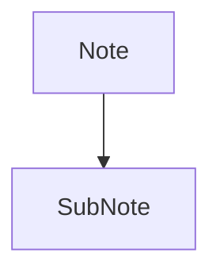

# Obsidian Vault

Use this skill for filesystem-first Obsidian vault work: reading notes, listing notes, searching note files, creating notes, appending content, and adding wikilinks.

## Vault path

Use a known or resolved vault path before calling file tools.

The documented vault-path convention is the `OBSIDIAN_VAULT_PATH` environment variable, for example from `~/.hermes/.env`. If it is unset, use `~/Documents/Obsidian Vault`.

File tools do not expand shell variables. Do not pass paths containing `$OBSIDIAN_VAULT_PATH` to `read_file`, `write_file`, `patch`, or `search_files`; resolve the vault path first and pass a concrete absolute path. Vault paths may contain spaces, which is another reason to prefer file tools over shell commands.

If the vault path is unknown, `terminal` is acceptable for resolving `OBSIDIAN_VAULT_PATH` or checking whether the fallback path exists. Once the path is known, switch back to file tools.

## Read a note

Use `read_file` with the resolved absolute path to the note. Prefer this over `cat` because it provides line numbers and pagination.

## List notes

Use `search_files` with `target: "files"` and the resolved vault path. Prefer this over `find` or `ls`.

- To list all markdown notes, use `pattern: "*.md"` under the vault path.
- To list a subfolder, search under that subfolder's absolute path.

## Search

Use `search_files` for both filename and content searches. Prefer this over `grep`, `find`, or `ls`.

- For filenames, use `search_files` with `target: "files"` and a filename `pattern`.
- For note contents, use `search_files` with `target: "content"`, the content regex as `pattern`, and `file_glob: "*.md"` when you want to restrict matches to markdown notes.

## Create a note

Use `write_file` with the resolved absolute path and the full markdown content. Prefer this over shell heredocs or `echo` because it avoids shell quoting issues and returns structured results.

## Note Quality Standards (ATM Machine Grade)

Every project note in the vault MUST follow these quality standards. This is NOT optional — Obsidian is a mandatory phase of every project workflow.

### Main Project Note Template (`Projects/<name>/<Name>.md`)

```
# <Project Name>

<One-paragraph summary>

## Overview
<Broader description: what it does, why, who it's for>

## Key Features
- <Feature> — <explanation>
- <Feature> — <explanation>

## Project Structure
```text
project/
├── src/
│   └── <file>      # Purpose
```

## Architecture
<For each major class/module: purpose, key methods, edge cases>

## Code Patterns
```<language>
<concrete usage example>
```

## Related Files
- [[Note]] — description

## Knowledge Graph Map


## Tags
#project #language #category
```

### Supporting Note Template (per module/file)
```
# <Module Name>

<One-paragraph purpose>

## Class Definition
class <Name>: <key fields>

## Methods
| Method | Description |

## Key Implementation Details
<Edge cases, design decisions, important algorithms>

## Knowledge Graph Position
```mermaid
graph TD
    <module> --> <related>
```

## Related Files
- [[Parent Note]]

## Tags
#project #<module-tag>
```

### Mandatory Rules
1. **Always include wikilinks** (`[[Note Name]]`) — every note must link to at least its parent project note
2. **Always include a Mermaid knowledge graph map** on the main project note
3. **Always include tags** at the bottom (project tag + language tag + category tag)
4. **Use `write_file`** for new notes — never shell heredocs or `echo`
5. **Use `patch`** for targeted edits to existing notes
6. **Update notes continuously** as the project evolves, not just at the end
7. **Graphify is mandatory partner** — the Obsidian bundle now includes `graphify-integrate` as a required layer. Graphify exports code-symbol notes with wikilinks directly into the vault, creating a complementary code-level knowledge graph. After every Graphify export, refresh the vault knowledge graph via `obsidian-knowledge-graph`.

### Reference Files
- `references/atm-machine-note-example.md` — concrete example of ATM Machine project note quality (the reference standard)
- `references/graphify-obsidian-integration.md` — using Graphify (code-level knowledge graph) to generate [[wikilinked]] code-symbol notes in the vault
- `templates/atm-machine-main-note.md` — ready-to-copy main note skeleton

### See Also
- `free-ai-model-router` skill's "Obsidian: Always Part of the Workflow" section for the full note quality specification
- `decide` skill's "Mandatory Include Rule" — ensures Obsidian is always selected for project tasks

## Knowledge-Graph MCP Server
Hermes includes a file-tool MCP server that scans any Obsidian vault and produces a structured node/edge knowledge graph. Usages: "generate my knowledge graph" → `obsidian_knowledge_graph`, "how is my vault connected?" → `obsidian_graph_summary`.

Schema:
- Vault root → folder nodes → note nodes → code_block / section nodes
- tag nodes (global) and concept nodes (cross-note terms ≥ 2 occurrences)
- Edge types: `contains`, `links_to`, `tagged`, `references`, `depends_on`, `alias_of`, `shared_concept`

### Writing a similar stdio MCP scanner (template)
The pattern in `obsidian_kg_mcp.py` is a minimal, reusable stdio MCP server:
1. Define `Node`/`Edge` dataclasses + `scan_vault()` that walks a directory and emits `{nodes, edges}`.
2. Wrap in an `mcp.server.Server`, register tools with `@app.list_tools()` / `@app.call_tool()`.
3. `main()` runs the server via `mcp.server.stdio.stdio_server`.
4. Register under `mcp_servers.<name>` in `~/.hermes/config.yaml` with `command: python`, `args: ["-m", "module_name"]`, and the correct `cwd`.

### Knowledge-Graph Rendering Script
`scripts/render_kg.py` converts the JSON output of `obsidian_knowledge_graph` into an interactive standalone HTML graph (vis-network CDN, Catppuccin dark theme). Run it after generating the graph to get an browser-viewable map with search, filter, and node details.

### Pitfalls
- **`execute_code` approval blocks**: Subprocess pty requests ("User has NOT consented") can block `execute_code` or `terminal`. Use direct shell for quick probes and don't let it silently time out.
- **`vscode-mcp-server` deprecation status**: The npm package shows `vscode-mcp-server@0.2.0` deprecated on npm, but it still starts and responds to MCP handshakes correctly on Windows via `npx -y`. It works for connectivity tests today; do not hardcode a `.cmd` global path — use `npx -y` so npm resolves it whether or not it's globally installed. Long-term reliability depends on whether the package is maintained beyond deprecation.
- **Type mixing in scanners**: Use `Node` dataclass instances throughout the scan and only call `.to_dict()` at flatten time. Don't mix typed and dict objects into the same typed collection before calling typed methods — it causes `'dict' object has no attribute 'to_dict'` errors.

## Append to a note

Prefer a native file-tool workflow when it is not awkward:

- Read the target note with `read_file`.
- Use `patch` for an anchored append when there is stable context, such as adding a section after an existing heading or appending before a known trailing block.
- Use `write_file` when rewriting the whole note is clearer than constructing a fragile patch.

For an anchored append with `patch`, replace the anchor with the anchor plus the new content.

For a simple append with no stable context, `terminal` is acceptable if it is the clearest safe option.

## Targeted edits

Use `patch` for focused note changes when the current content gives you stable context. Prefer this over shell text rewriting.

## Wikilinks

Obsidian links notes with `[[Note Name]]` syntax. When creating notes, use these to link related content.
