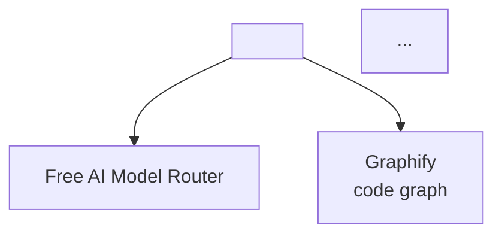

# Obsidian + Graphify Mandatory Bundle — Session Notes

**Date**: June 11, 2026
**Projects documented**: ecosystem-test (System Dashboard), task-manager-cli (Task Manager CLI)

---

## Mandatory Bundle Rule (Per /decide)

> **Rule 2**: Any project, coding, design, or analysis task → always include the full Obsidian+Graphify bundle as a mandatory post-execution phase:
> `obsidian` + `obsidian-codebase-graph` + `obsidian-knowledge-graph` + `graphify-integrate`

> **Rule 3**: After every Obsidian or Graphify update → always regenerate the knowledge graph via `obsidian-knowledge-graph`.

---

## Two Test Projects — ATM Quality Notes Created

### 1. System Dashboard (`ecosystem-test`)

**Vault path**: `Projects/ecosystem-test/System Dashboard.md`
**Graphify export**: `Projects/ecosystem-test/graphify/` (13 → 22 notes with Gemini)

**Note structure**:
- Overview — what it does, why
- Key Features — 6 bullet points with explanations
- Project Structure — ASCII tree with file purposes
- Architecture — Function table with dependencies
- Code Patterns — Concrete C# examples
- Model Selection Trace — 5-step trace with Graphify context
- **Graphify Integration** — Metrics table (AST vs AST+Gemini), graph insights
- Related Files — 5 wikilinks to ecosystem components
- Knowledge Graph Map — Mermaid with Graphify node
- Tags — `#ecosystem-test #csharp #dotnet #model-routing #graphify`

### 2. Task Manager CLI (`task-manager-cli`)

**Vault path**: `Projects/task-manager-cli/Task Manager CLI.md`
**Graphify export**: `Projects/task-manager-cli/graphify/` (74 notes)

**Note structure**:
- Overview — production-quality CLI with clean architecture
- Key Features — Table of 8 features with implementations
- Project Structure — 4-level ASCII tree
- Architecture — 4 component breakdown (Program, Models, Services, Commands)
- Code Patterns — Priority color coding, box-drawn tables
- Model Selection Trace — 5 steps with Graphify context
- **Graphify Integration** — 60 nodes, 95 edges, 14 communities, architecture insights
- **Freebuff Integration** — Verified connection, session tracking
- Related Files — 6 wikilinks
- Knowledge Graph Map — Mermaid with Graphify→Model Router edge
- Tags — `#task-manager-cli #csharp #dotnet #clean-architecture #graphify #freebuff`

---

## Cross-Linking Strategy Applied

| From Note | To Note | Relationship |
|-----------|---------|--------------|
| System Dashboard | Free AI Model Router | Model selection skill |
| System Dashboard | Model Recommender Workflow | Task→model mapping |
| System Dashboard | Freebuff | Alternative coding agent |
| System Dashboard | OpenCode | Primary coding agent |
| System Dashboard | Free AI Tools | Model catalog |
| Task Manager CLI | All above + Graphify | Code knowledge graph |
| Task Manager CLI | System Dashboard | Previous ecosystem test |
| AI Ecosystem Dashboard | Both test projects | Added to project structure |

---

## Knowledge Graph Growth

| Metric | After Test 1 | After Test 2 |
|--------|--------------|--------------|
| Nodes | 175 | 266 |
| Edges | 407 | 1,053 |
| HTML size | 70 KB | 217 KB |
| Graphify notes added | 13 → 22 | 74 |

**Growth pattern**: Each project adds its Graphify code-symbol notes (13-74) plus the main project note, and the KG scanner picks up all wikilinks, tags, and code blocks.

---

## Refresh Commands (Post-Project)

```bash
# 1. Scan vault → JSON
python ~/AppData/Local/hermes/skills/note-taking/obsidian-knowledge-graph/scripts/scan_vault.py \
  "~/Documents/Obsidian Vault" "~/Documents/Obsidian Vault/kg_output.json"

# 2. Render JSON → HTML
python ~/AppData/Local/hermes/skills/note-taking/obsidian/scripts/render_kg.py \
  "~/Documents/Obsidian Vault/kg_output.json" "~/Documents/Obsidian Vault/knowledge_graph.html"

# 3. Open in browser (Windows)
start ~/Documents/Obsidian Vault/knowledge_graph.html
```

---

## Quality Checklist for Every Project Note

- [ ] One-paragraph summary
- [ ] Overview section
- [ ] Key Features (bulleted with explanations)
- [ ] Project Structure (ASCII tree)
- [ ] Architecture (tables/bullets per component)
- [ ] Code Patterns (concrete examples in fenced blocks)
- [ ] Model Selection Trace (if coding task)
- [ ] Graphify Integration section (nodes/edges/communities)
- [ ] Related Files (wikilinks to ecosystem components)
- [ ] Knowledge Graph Map (Mermaid diagram)
- [ ] Tags (project + language + framework + category)
- [ ] Graphify export completed (`graphify export obsidian`)
- [ ] Knowledge graph refreshed (`scan_vault.py` + `render_kg.py`)

---

## Pitfalls to Avoid

| Pitfall | Prevention |
|---------|------------|
| Note without wikilinks | Always link to at least: Free AI Model Router, Model Recommender, Graphify, Freebuff, OpenCode |
| Missing Mermaid graph | Include on every main project note |
| Skipping Graphify export | Mandatory per /decide — run `graphify export obsidian` |
| Not refreshing KG | Mandatory per /decide — run both scan + render |
| Writing notes only at end | Update continuously as code evolves |
| Using shell heredocs | Use `write_file` for new, `patch` for edits |

---

## Template: New Project Note Skeleton

```markdown
# <Project Name>

<One-paragraph summary>

## Overview
<Broader description>

## Key Features
- <Feature> — <explanation>

## Project Structure
```text
project/
├── <file>      # Purpose
```

## Architecture
<Component breakdown>

## Code Patterns
```<language>
<example>
```

## Model Selection Trace
1. Task type: `<type>`
2. Primary model: `<model>` ✅
3. Fallback chain: ...
4. Graphify context: ...
5. Verified: ...

## Graphify Integration
| Metric | Value |
|--------|-------|
| Nodes | <n> |
| Edges | <n> |
| Communities | <n> |
| Export | <n> Obsidian notes |

## Related Files
- [[Free AI Model Router]] — ...
- [[Graphify]] — ...
- [[Freebuff]] — ...

## Knowledge Graph Map


## Tags
#<project> #<lang> #<framework> #<category>
```

---

*Session notes for maintaining ATM-quality Obsidian + Graphify integration on all future projects.*