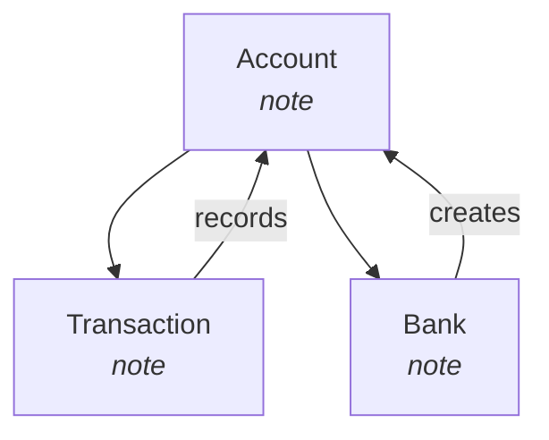

# Obsidian Knowledge Graph & Flowchart Patterns

Patterns discovered in this session for turning an Obsidian vault into a navigable knowledge graph with both interactive HTML and inline Mermaid diagrams.

## Vault Structure Assumptions

- Root vault at `~/Documents/Obsidian Vault` (or `$OBSIDIAN_VAULT_PATH`)
- Projects under `Projects/<Project Name>/`
- Notes use `[[Wikilinks]]` for cross-references
- Tags use `#tag` syntax
- Code blocks in fenced markdown: ```lang ... ```

## MCP Server: obsidian_kg_mcp.py

Located at `~/.hermes/tools/obsidian_kg_mcp.py`. Scans vault and produces:

### Nodes
| Type | Description | Shape | Color |
|------|-------------|-------|-------|
| `vault` | Root vault node | diamond | blue |
| `folder` | Subdirectory | hexagon | green |
| `note` | Markdown file | box | yellow |
| `code_block` | Meaningful code block (logic/workflow) | triangle | orange |
| `tag` | `#tag` | dot | purple |
| `concept` | Cross-note term (≥N occurrences) | ellipse | red |
| `alias` | Frontmatter `aliases: [...]` | square | teal |

### Edges
| Type | Source→Target | Style |
|------|---------------|-------|
| `contains` | folder→note, note→code_block | solid dark |
| `links_to` | note→note (wikilink) | solid blue |
| `tagged` | note→tag | dashed purple |
| `shared_concept` | note→concept | dashed red |
| `alias_of` | note→alias | dashed teal |

### Tools Exposed
```python
obsidian_knowledge_graph(
    vault_path: str,
    include_code_blocks: bool = True,
    include_concepts: bool = True,
    concept_min_occurrences: int = 2
) -> {nodes, edges, stats}

obsidian_graph_summary(vault_path: str) -> str  # human-readable text
```

## Interactive HTML Rendering (pyvis)

Key hierarchical layout options for clean tree structure:

```python
net.set_options("""
{
  "layout": {
    "hierarchical": {
      "enabled": true,
      "direction": "UD",
      "levelSeparation": 180,
      "nodeSpacing": 220,
      "treeSpacing": 280,
      "blockShifting": true,
      "parentCentralization": true
    }
  },
  "physics": {
    "hierarchicalRepulsion": {
      "centralGravity": 0.0,
      "springLength": 200,
      "springConstant": 0.02,
      "nodeDistance": 180,
      "damping": 0.9
    },
    "solver": "hierarchicalRepulsion",
    "stabilization": {"enabled": true, "iterations": 300}
  }
}
""")
```

**Refresh command:**
```bash
cd ~/Documents/Projects/atm-machine && "C:\Program Files\Python311\python.exe" render_graph.py
```

## Mermaid Flowcharts in Notes

Each note gets a `## Knowledge Graph Position` section with a local Mermaid diagram:

```markdown
## Knowledge Graph Position



**Pattern:**
- Parent project note shows full folder hierarchy
- Child notes show immediate neighbors + dependency edges
- `<br/><i>type</i>` gives visual type hints
- Renders natively in Obsidian — no plugin required

## Automation: Auto-Update on File Change

Could be implemented as a cron job:
```yaml
# ~/.hermes/config.yaml (cron section)
schedule: "5m"
prompt: |
  Run the Obsidian knowledge graph scanner on the vault and regenerate
  knowledge_graph.html if any .md files changed since last run.
skills: ["obsidian-kg"]
```

## Related Files

- `references/obsidian-knowledge-graph-mcp.md` — MCP server patterns
- `templates/atm-project-structure.md` — Starter project layout
