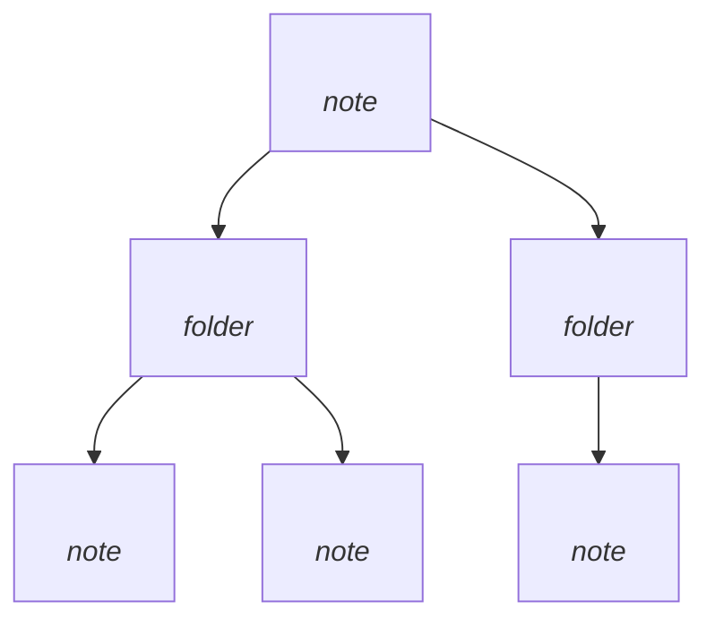

# <Project Name>

<One-paragraph summary describing what the project is and its core purpose>

## Overview

<Broader description: what it does, why it exists, who it's for, key design philosophy>

## Key Features

- **<Feature 1>** — <brief explanation of what it does>
- **<Feature 2>** — <brief explanation>
- **<Feature 3>** — <brief explanation>
- **<Feature 4>** — <brief explanation>

## Project Structure

```text
project-name/
├── src/
│   ├── <module>/
│   │   ├── <file>.<ext>    # Purpose of this file
│   │   └── <file>.<ext>    # Purpose of this file
│   ├── <module>/
│   │   └── <file>.<ext>    # Purpose
│   └── <entry-point>       # Where execution starts
├── tests/
│   └── <test-file>.<ext>   # Test suite description
└── DESIGN.md               # Design specification
```

## Architecture

### <Class/Module 1>
- **Purpose**: <what this class does>
- **Key Methods**: `method_name()` — description, `method2()` — description
- **Edge Cases**: <notable edge cases or error handling>
- **Validation**: <what gets validated and how>

### <Class/Module 2>
- **Purpose**: <what this class does>
- **Key Methods**: `method_name()` — description

### <UI / Interface Layer>
- **Purpose**: <how users interact>
- **Flow**: <entry → menu → actions → exit flow>

## Code Patterns

```<language>
# <Brief description of what this example shows>
<concrete code example showing the core API usage>
```

## Related Files

- [[Note 1]] — description of relationship
- [[Note 2]] — description of relationship
- [[Note 3]] — description of relationship

## Knowledge Graph Map



## Tags

#project-name #language #framework #category
