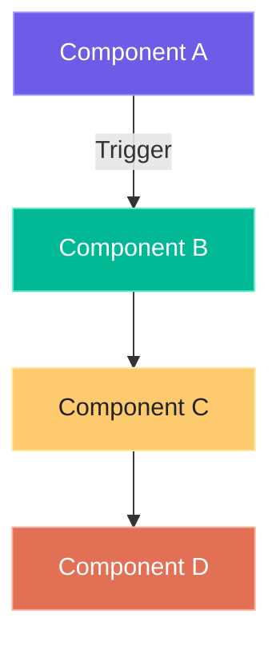
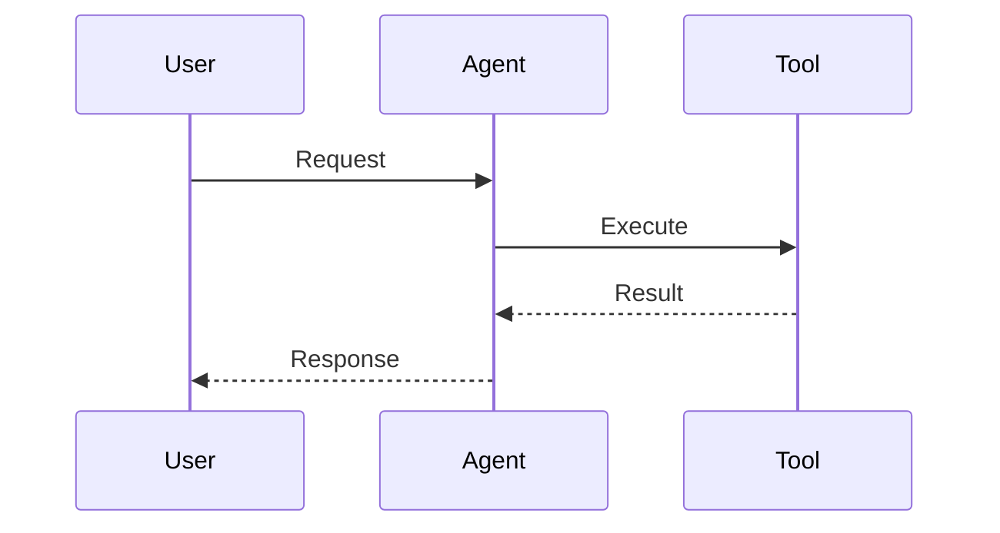
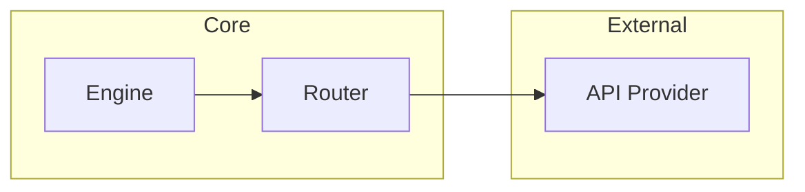

# 📝 Obsidian Docs — Mandatory Documentation

## Role

Every project, setup, implementation, or analysis task produces a documentation artifact. This skill enforces the quality standard and ensures the Obsidian vault stays current.

## ATM-Machine Quality Standard

Every note must contain all of the following sections. Missing sections are blocked — the note is not complete until every header is filled.

## Template

```markdown
---
tags: [project, hermes, <domain>]
created: YYYY-MM-DD
updated: YYYY-MM-DD
---
# {{Project Name}}

## Overview

{{1-3 paragraphs describing what this project/system does. Who is it for? What problem does it solve?}}

**Key features:**
- {{Feature 1}}
- {{Feature 2}}
- {{Feature 3}}

## Features

### {{Feature 1}}
{{Description. How it works. Why it matters.}}

### {{Feature 2}}
{{Description. How it works. Why it matters.}}

### {{Feature 3}}
{{Description. How it works. Why it matters.}}

## Project Structure

```
{{project-root}}/
├── {{dir}}/        # {{purpose}}
├── {{file}}        # {{purpose}}
└── {{file}}        # {{purpose}}
```

## Architecture

{{Describe the architecture. How do components interact? What are the data flows? Use one of these approaches:}}

### System Flow


### Data Flow


### Component Dependency


## Code Patterns

### {{Pattern 1 Name}}
```{{language}}
{{key code example}}
```
{{Why this pattern exists. What problem it solves.}}

### {{Pattern 2 Name}}
```{{language}}
{{key code example}}
```
{{Why this pattern exists. What problem it solves.}}

## Key Files

| File | Purpose |
|------|---------|
| `path/to/file` | {{purpose}} |
| `path/to/file` | {{purpose}} |

## Dependencies

| Dependency | Version | Purpose |
|------------|---------|---------|
| {{package}} | {{version}} | {{purpose}} |
| {{package}} | {{version}} | {{purpose}} |

## Wikilinks

Link to related projects and notes in the vault:

- [[{{Related Project 1}}]]
- [[{{Related Project 2}}]]
- [[{{Related Skill}}]]
- [[{{Related Model}}]]
```

## Enforcement

The `/decide` skill enforces this at step 7 of the execution order. The note is written before the KG refresh step. If the note is incomplete (missing sections), the pipeline blocks and requests the missing content.

## KG Refresh Trigger

After every note write or update, trigger the KG refresh:

```bash
# Scan vault into JSON
python3 /path/to/scan_vault.py

# Render galaxy visualization
python3 /path/to/render_galaxy_kg.py
```

This ensures the interactive galaxy graph always reflects the latest vault state.

## Post-Merge / Post-Commit Hook

When this repo receives changes (new skill, new config, updated docs), the KG refresh must run:

```bash
# 1. Update Graphify code graph
cd /path/to/project
graphify update .

# 2. Scan vault changes
python3 /path/to/scan_vault.py

# 3. Regenerate visualization
python3 /path/to/render_galaxy_kg.py

# 4. Update website (if applicable)
```

This ensures the knowledge graph stays synchronized with the codebase and documentation.
